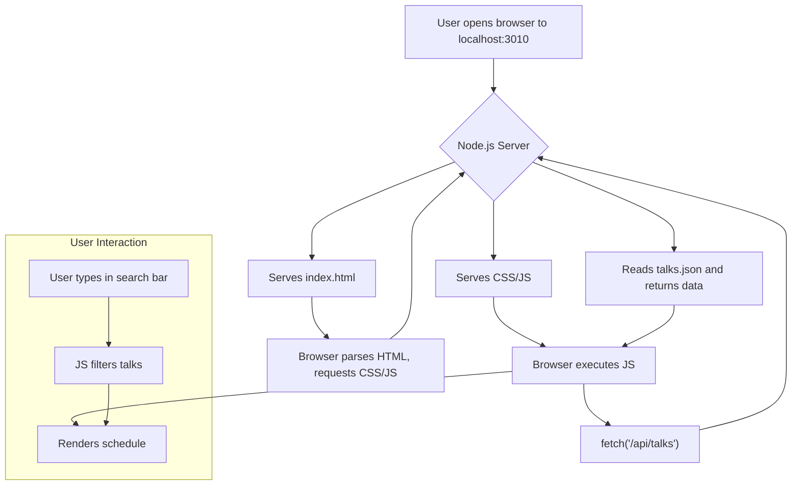

# Request/Response Flow

This document illustrates the request and response flow for the Event Talks App.

## Application Flowchart

## Loading the Application

1.  **User** opens the browser and navigates to `http://localhost:3010`.

2.  **Browser** sends a `GET` request to the server for the root path (`/`).

3.  **Server** receives the request and serves the `index.html` file.

4.  **Browser** parses the `index.html` file and discovers the linked `styles.css` and `script.js` files.

5.  **Browser** sends `GET` requests for `styles.css` and `script.js`.

6.  **Server** serves the requested CSS and JavaScript files.

## Fetching the Talks Data

1.  The **`script.js`** file is executed, which triggers a `GET` request to the `/api/talks` endpoint.

2.  **Server** receives the request and reads the `talks.json` file.

3.  **Server** sends a response with a status code of `200 OK` and the content of `talks.json` in the response body. The `Content-Type` header is set to `application/json`.

4.  **Client** receives the JSON data and parses it.

5.  The **`renderSchedule`** function is called to display the talks on the page.

## Filtering the Schedule

1.  **User** types in the search bar.

2.  An **`input`** event is triggered on the search bar.

3.  The event listener in **`script.js`** filters the `talks` array based on the search term.

4.  The **`renderSchedule`** function is called again with the filtered list of talks, and the displayed schedule is updated.